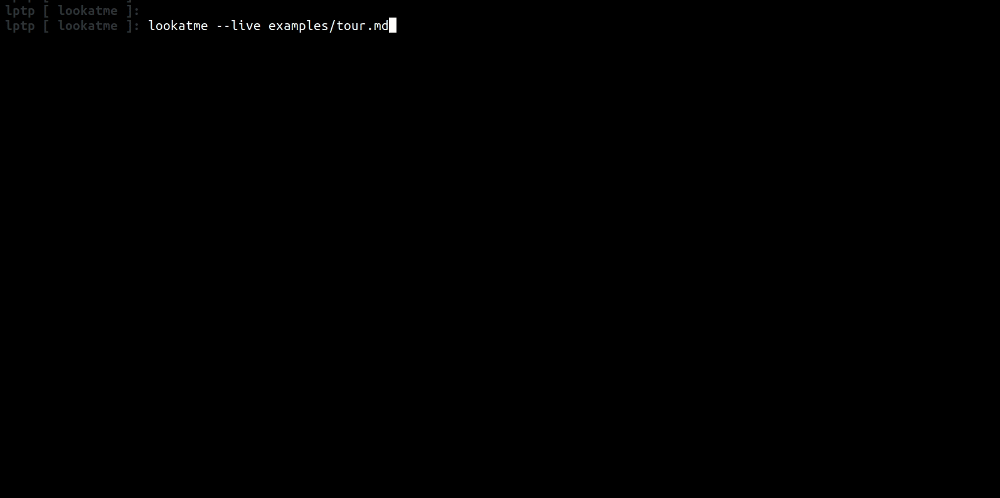
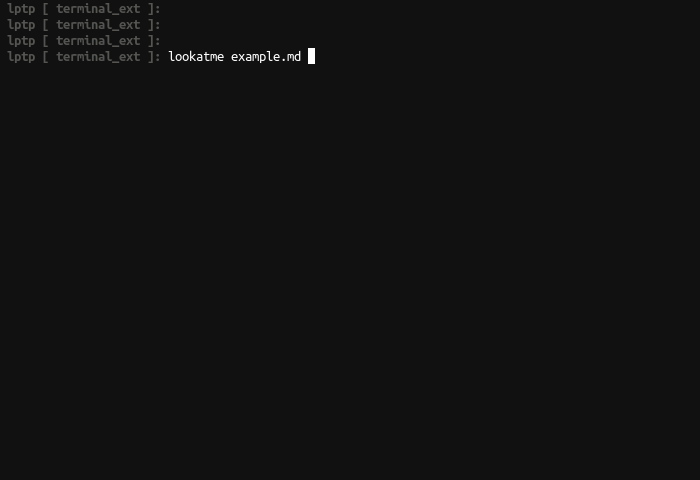
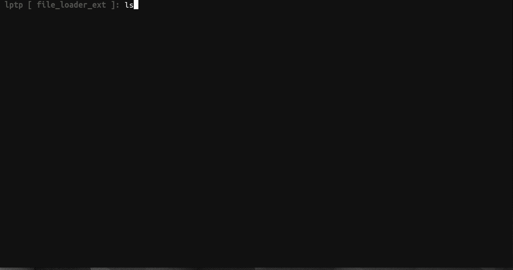

[](https://travis-ci.org/d0c-s4vage/lookatme)
[](https://coveralls.io/github/d0c-s4vage/lookatme?branch=master)
[](https://pypistats.org/packages/lookatme)
[](https://pypi.python.org/pypi/lookatme/)
[](https://lookatme.readthedocs.io/en/latest/)

[](https://twitter.com/d0c_s4vage)

# `lookatme`

`lookatme` is an interactive, extensible, terminal-based markdown presentation
tool.

## TOC

- [TOC](#toc)
- [Features](#features)
  * [Tour](#tour)
- [Navigating the Presentation](#navigating-the-presentation)
- [CLI Options](#cli-options)
- [Known Extensions](#known-extensions)
- [Documentation](#documentation)

## Features

* Markdown rendering
* Live (input file modification time watching) and manual reloading
* Live terminals embedded directly in slides
* Syntax highlighting using [Pygments](https://pygments.org/)
* Loading external files into code blocks
* Support for contrib extensions
* Smart slide splitting

### Tour

General tour



Embedded terminal example



Sourcing external files example



## Navigating the Presentation

| Action                         | Keys                             | Notes |
|--------------------------------|----------------------------------|-------|
| Next Slide                     | `l j right space`                |       |
| Prev Slide                     | `h k left delete backspace`      |       |
| Quit                           | `q Q`                            |       |
| Terminal Focus                 | Click on the terminal            |       |
| Exit Terminal                  | `ctrl+a` and then a slide action |       |
| Vertically scroll within slide | `up/down or page up/page down`   |       |

## CLI Options

```
Usage: lookatme [OPTIONS] [INPUT_FILES]...

  lookatme - An interactive, terminal-based markdown presentation tool.

Options:
  --debug
  -l, --log PATH
  -t, --theme [dark|light]
  -s, --style [default|emacs|friendly|colorful|autumn|murphy|manni|monokai|perldoc|pastie|borland|trac|native|fruity|bw|vim|vs|tango|rrt|xcode|igor|paraiso-light|paraiso-dark|lovelace|algol|algol_nu|arduino|rainbow_dash|abap|solarized-dark|solarized-light|sas|stata|stata-light|stata-dark|inkpot]
  --dump-styles                   Dump the resolved styles that will be used
                                  with the presentation to stdout

  --live, --live-reload           Watch the input filename for modifications
                                  and automatically reload

  --single, --one                 Render the source as a single slide
  --version                       Show the version and exit.
  --help                          Show this message and exit.
```

## Known Extensions

Below is a list of known extensions for lookatme:

| Extension Name | Install Name                    | Url                                                           |
|----------------|---------------------------------|---------------------------------------------------------------|
| qrcode         | lookatme.contrib.qrcode         | https://github.com/d0c-s4vage/lookatme.contrib.qrcode         |
| image_ueberzug | lookatme.contrib.image_ueberzug | https://github.com/d0c-s4vage/lookatme.contrib.image_ueberzug |

## Documentation

See the [documentation](https://lookatme.readthedocs.io/en/latest/) for details.
