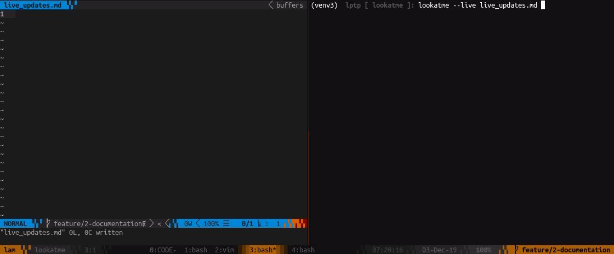

.. _getting_started:

Getting Started
===============

Installation
------------

``lookatme`` can be installed with pip using the command:

.. code-block:: bash

    pip install lookatme

Usage
-----

The ``lookatme`` CLI has a few options to control it's behavior:

.. code-block:: text

   Usage: lookatme [OPTIONS] [INPUT_FILES]...

      lookatme - An interactive, terminal-based markdown presentation tool.

      See https://lookatme.readthedocs.io/en/v{{VERSION}} for documentation

    Options:
      --debug
      -l, --log PATH
      -t, --theme [dark|light]
      --style [default|emacs|friendly|friendly_grayscale|colorful|autumn|murphy|manni|material|monokai|perldoc|pastie|borland|trac|native|fruity|bw|vim|vs|tango|rrt|xcode|igor|paraiso-light|paraiso-dark|lovelace|algol|algol_nu|arduino|rainbow_dash|abap|solarized-dark|solarized-light|sas|staroffice|stata|stata-light|stata-dark|inkpot|zenburn|gruvbox-dark|gruvbox-light|dracula|one-dark|lilypond|nord|nord-darker|github-dark]
      --dump-styles                   Dump the resolved styles that will be used
                                      with the presentation to stdout
      --live, --live-reload           Watch the input filename for modifications
                                      and automatically reload
      -s, --safe                      Do not load any new extensions specified in
                                      the source markdown. Extensions specified
                                      via env var or -e are still loaded
      --no-ext-warn                   Load new extensions specified in the source
                                      markdown without warning
      -i, --ignore-ext-failure        Ignore load failures of extensions
      -e, --exts TEXT                 A comma-separated list of extension names to
                                      automatically load (LOOKATME_EXTS)
      --single, --one                 Render the source as a single slide
      --version                       Show the version and exit.
      --help                          Show this message and exit.

``--live`` / ``--live-reload``
^^^^^^^^^^^^^^^^^^^^^^^^^^^^^^

This flag turns on live reloading within lookatme. If the input markdown
is a filepath (and not stdin), the filepath with be watched for changes to its
modification time. If a change to the file's modification time is observed,
the slide deck is re-read and rendered, keeping the current slide in focus.

If your editor supports saving with every keystroke, instant slide updates
are possible:

``-e EXT_NAME1,EXT_NAME2`` / ``--exts EXT_NAME1,EXT_NAME2``
^^^^^^^^^^^^^^^^^^^^^^^^^^^^^^^^^^^^^^^^^^^^^^^^^^^^^^^^^^^

Allows a comma-separated list of extension names to be pre-loaded into lookatme
without requring them to be declared in the Markdown source.

``-s`` / ``--safe``
^^^^^^^^^^^^^^^^^^^

Do **NOT** load any new extensions specified in the markdown (ignore them). New
extensions are extensions that have not manually been allowed via the ``-e``
argument or the ``LOOKATME_EXTS`` environment variable.

``--no-ext-warn``
^^^^^^^^^^^^^^^^^

Do not warn about new extensions that are to-be-loaded that are specified in
the source markdown. New extensions are extensions that have not manually been
allowed via the ``-e`` argument or the ``LOOKATME_EXTS`` environment variable.

``-i``
^^^^^^

Ignore failure loading extensions. This does not ignore warnings, but ignores
any hard-errors during import, such as ``ImportError``.

``--single`` / ``--one``
^^^^^^^^^^^^^^^^^^^^^^^^

Render the markdown source as a single slide, ignoring all hrules. Scroll
overflowing slides with the up/down arrow keys and page up/page down.

``--debug`` and ``--log``
^^^^^^^^^^^^^^^^^^^^^^^^^

Turns on debug logging for lookatme. The debug log will be created in your platform's
temporary directory by default and will be named ``lookatme.log``:

.. code-block:: bash

    $> lookatme slides.md --debug
    
    # in another terminal
    $> tail -f /tmp/lookatme.log
    DEBUG:lookatme.RENDER:  Rendering token {'type': 'heading', 'level': 2, 'text': 'TOC'}
    DEBUG:lookatme.RENDER:  Rendering token {'type': 'list_start', 'ordered': False}
    DEBUG:lookatme.RENDER:    Rendering token {'type': 'list_item_start'}
    DEBUG:lookatme.RENDER:      Rendering token {'type': 'text', 'text': '[Features](#features)'}
    DEBUG:lookatme.RENDER:      Rendering token {'type': 'list_start', 'ordered': False}
    DEBUG:lookatme.RENDER:        Rendering token {'type': 'list_item_start'}
 
You may set a custom log location with the ``--log`` flag

``--theme``
^^^^^^^^^^^

Themes in lookatme are pre-defined stylings. Lookatme comes with two built-in
themes: ``dark`` and ``light``. These themes are intended to look good on
dark terminals and light terminals.

See the :ref:`dark_theme` and :ref:`light_theme` pages for more details.
See the :ref:`style_precedence` page for details on the order style overrides
and settings are applied.

``--style``
^^^^^^^^^^^

This option overrides the `Pygments <https://pygments.org/>`_  syntax highlighting
style to use. See the :ref:`style_precedence` for details about style overriding
order.

At the time of this writing, available Pygments style options include:

  * default
  * emacs
  * friendly
  * colorful
  * autumn
  * murphy
  * manni
  * monokai
  * perldoc
  * pastie
  * borland
  * trac
  * native
  * fruity
  * bw
  * vim
  * vs
  * tango
  * rrt
  * xcode
  * igor
  * paraiso-light
  * paraiso-dark
  * lovelace
  * algol
  * algol_nu
  * arduino
  * rainbow_dash
  * abap
  * solarized-dark
  * solarized-light
  * sas
  * stata
  * stata-light
  * stata-dark

``--dump-styles``
^^^^^^^^^^^^^^^^^

Print the final, resolved style definition that will be used to render the
markdown as currently specified on the command-line. See the :ref:`style_precedence`
section for details on how this works.

E.g.:

.. code-block:: bash

    lookatme examples/tour.md -theme --style solarized-dark --dump-styles
