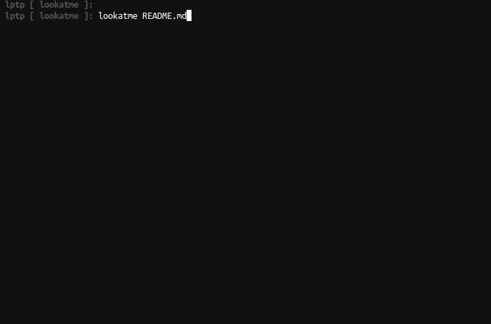

.. _smart_splitting:

Smart Slide Splitting
=====================

lookatme will automatically split input markdown into separate slides if no
``hrules`` are present in the input markdown.

Slides are split automatically in two ways

  1. If the lowest (e.g. h1 < h2) heading occurs only once, that heading is
     used as the title for the presentation. The next lowest heading will
     be used as the slide separator marker.
  2. If the lowest (e.g. h1 < h2) heading occurs multiple times, that heading
     will be used as the slide separator marker and the heading will not
     be set.

E.g., below is the README.md of lookatme:

